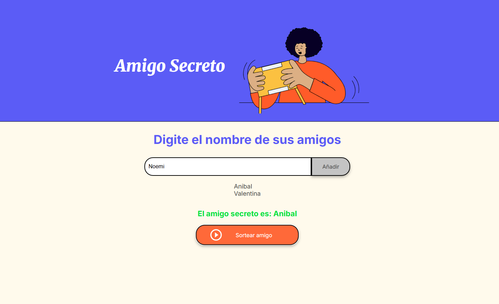

# Amigo Secreto
[https://acolombini.github.io/challenge_AlluraLatam](Visita el sitio)

Esta aplicación permite a los usuarios agregar nombres de amigos y realizar un sorteo aleatorio para seleccionar un "amigo secreto".

## Funcionalidades

1. **Agregar nombres**: Los usuarios pueden escribir el nombre de un amigo en un campo de texto y agregarlo a una lista visible al hacer clic en "Añadir".
2. **Validar entrada**: Si el campo de texto está vacío, el programa muestra una alerta pidiendo un nombre válido.
3. **Visualizar la lista**: Los nombres ingresados aparecen en una lista debajo del campo de entrada.
4. **Sorteo aleatorio**: Al hacer clic en el botón "Sortear Amigo", se selecciona aleatoriamente un nombre de la lista y se muestra en la página.

## Capturas de pantalla

### Pantalla principal

### Lista de amigos

### Resultado del sorteo

